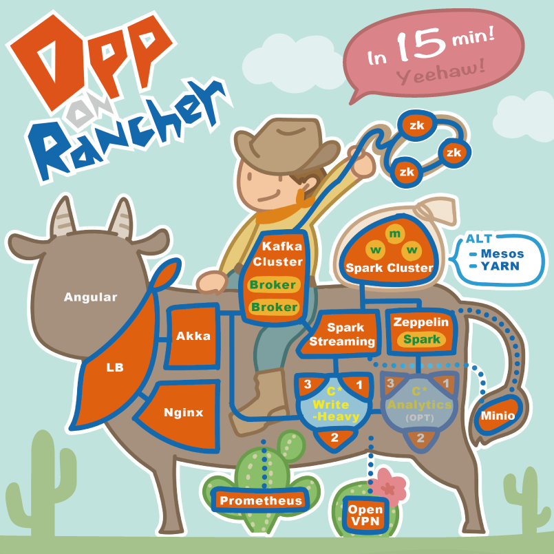
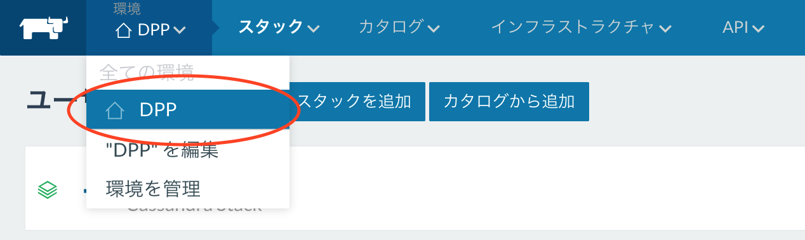
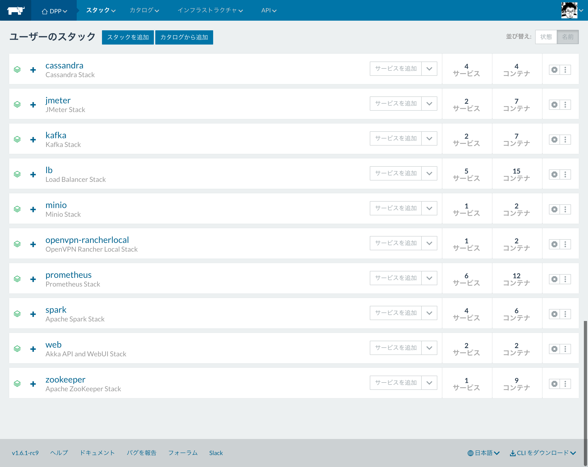

# ※ 受付は終了しています。 

### デモ環境の閲覧をご希望の方へ

[Rancher Meetup #01 in Osaka](https://rancherjp.connpass.com/event/58191/)でご紹介する、`DPP(Data Processing Platform) on Rancher`のデモ環境を

[try.rancher.com](https://try.rancher.com)で閲覧できるようにします。

閲覧をご希望のかたは、以下の手順をご確認ください。

1. Githubアカウントをご用意ください。
2. 参加希望の旨を、当リポジトリの[issue](https://github.com/RMO01-DPP-DEMO/request-to-join/issues)に登録してください。
3. こちらでissueを確認し、[RMO01-DPP-DEMO](https://github.com/RMO01-DPP-DEMO)にメンバーとして追加します。
4. 上記のGithubアカウントを用いて、[try.rancher.com](https://try.rancher.com)(無料)でのサインアップをお済ませください。
5. [Rancher Meetup #01 in Osaka](https://rancherjp.connpass.com/event/58191/)の**当日のみ**、[コチラ](https://try.rancher.com/env/1a547189/apps/stacks)でご覧いただくことができます。

##### NOTICE
* 当日イベントにご参加いただけない方もお気軽にご登録ください。
* デモ環境はイベントの翌日には閲覧できなくなります。
* ご自身で構築してみたい方のために、環境の設定ファイル等一式を別途アナウンス致します。

